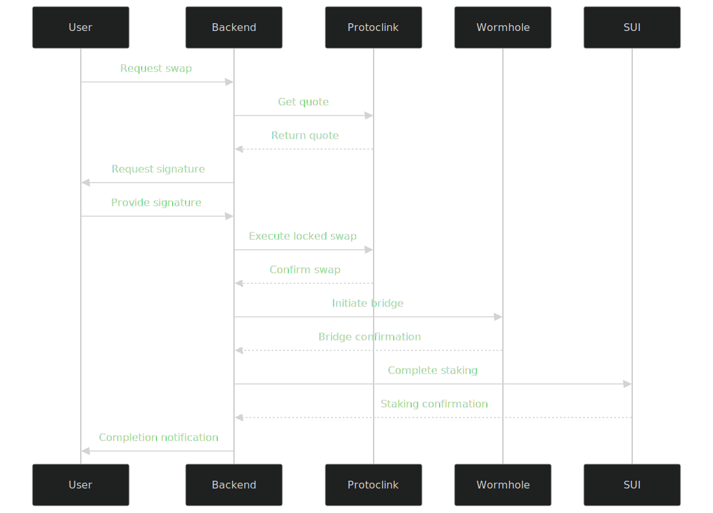

# Stranded Value Scanner API Documentation (Improved Version)

This document provides a comprehensive list of API endpoints for the Stranded Value Scanner application, incorporating Protoclink SDK for secure swaps and Wormhole bridge integration for cross-chain functionality.

## Base URL

All API endpoints are relative to the base URL of your deployed application.

## Key Improvements

1. **Protoclink Integration**: Replaced Rubic SDK with Protoclink's secure swap contract (0xDec80E988F4baF43be69c13711453013c212feA8)
2. **Enhanced Security**: Added token locking before swap execution to prevent reentrancy
3. **Wormhole Bridge**: Updated bridge endpoints to use Wormhole's official contract (0x98f3c9e6E3fAce36bAAd05FE09d375Ef1464288B)
4. **Signature Verification**: Added endpoints for Protoclink signature generation and verification

## Token Scanner Endpoints

### Scan Wallet for Tokens

```
GET /token-scanner/scan/:walletAddress
```

Scans a wallet address for tokens on Ethereum and Polygon networks.

**Parameters:**
- `walletAddress` (path): The Ethereum wallet address to scan

**Response:**
```json
{
  "topTokens": [
    {
      "chainId": "1",
      "tokenAddress": "0x...",
      "symbol": "TOKEN",
      "name": "Token Name",
      "decimals": 18,
      "balance": "0x...",
      "balanceFormatted": 10.5,
      "usdValue": 25.75,
      "canSwap": true
    }
  ],
  "hasStrandedValue": true
}
```

## Protoclink Swap Endpoints

### Generate Swap Signature

```
POST /token-scanner/protoclink/generate-signature
```

Generates a swap signature for Protoclink's locked contract.

**Request Body:**
```json
{
  "token": {
    "chainId": "1",
    "tokenAddress": "0x...",
    "symbol": "TOKEN",
    "balanceFormatted": 10.5
  },
  "walletAddress": "0x..."
}
```

**Response:**
```json
{
  "signature": "0x...",
  "expiry": 1678901234,
  "nonce": 12345
}
```

### Get Swap Quote

```
POST /token-scanner/swap/quote
```

Gets a quote using Protoclink's routing.

**Request Body:**
```json
{
  "token": {
    "chainId": "1",
    "tokenAddress": "0x...",
    "symbol": "TOKEN"
  },
  "walletAddress": "0x..."
}
```

**Response:**
```json
{
  "id": "quote-id",
  "srcTokenAddress": "0x...",
  "srcTokenAmount": "10.5",
  "dstTokenAmount": "25.75",
  "priceImpact": 0.5,
  "estimatedGasFee": "0.005",
  "protoclinkContract": "0xDec80E988F4baF43be69c13711453013c212feA8"
}
```

### Execute Locked Swap

```
POST /token-scanner/swap/execute
```

Executes a swap through Protoclink's locked contract.

**Request Body:**
```json
{
  "token": {
    "chainId": "1",
    "tokenAddress": "0x...",
    "symbol": "TOKEN"
  },
  "walletAddress": "0x...",
  "signature": "0x..."
}
```

**Response:**
```json
{
  "transactionHash": "0x...",
  "usdcObtained": "25.75",
  "gasCost": "0.005",
  "status": "PENDING",
  "lockedUntil": 1678901234
}
```

## Wormhole Bridge Endpoints

### Get Bridge Quote

```
POST /token-scanner/bridge/quote
```

Gets a quote for bridging through Wormhole.

**Request Body:**
```json
{
  "token": {
    "chainId": "1",
    "tokenAddress": "0xa0b86991c6218b36c1d19d4a2e9eb0ce3606eb48",
    "symbol": "USDC",
    "balanceFormatted": 100.0
  }
}
```

**Response:**
```json
{
  "srcTokenAmount": "100.0",
  "dstTokenAmount": "99.5",
  "bridgeFee": "0.5",
  "wormholeContract": "0x98f3c9e6E3fAce36bAAd05FE09d375Ef1464288B",
  "estimatedTime": "30"
}
```

### Execute Bridge Transfer

```
POST /token-scanner/bridge/execute
```

Executes a bridge transfer through Wormhole.

**Request Body:**
```json
{
  "token": {
    "chainId": "1",
    "tokenAddress": "0xa0b86991c6218b36c1d19d4a2e9eb0ce3606eb48",
    "symbol": "USDC",
    "balanceFormatted": 100.0
  },
  "walletAddress": "0x...",
  "destinationAddress": "0x.sui"
}
```

**Response:**
```json
{
  "transactionHash": "0x...",
  "bridgeSequence": "12345",
  "status": "PENDING",
  "estimatedArrival": 1678901234
}
```

## Repayment Endpoints

### Process Repayment

```
POST /token-scanner/repayment/process
```

Processes a repayment from bridged funds.

**Request Body:**
```json
{
  "walletAddress": "0x...",
  "bridgedAmount": "10.5",
  "repaymentSignature": "0x..."
}
```

**Response:**
```json
{
  "amountRepaid": "2.5",
  "remainingBalance": "8.0",
  "status": "CONFIRMED"
}
```

## Monitoring Endpoints

### Verify Contract State

```
GET /token-scanner/verify/:transactionHash
```

Verifies on-chain contract state.

**Response:**
```json
{
  "fundsLocked": true,
  "swapVerified": true,
  "bridgeInitiated": true
}
```

## Error Responses

### 400 Bad Request

```json
{
  "statusCode": 400,
  "message": "Invalid signature",
  "error": "Bad Request"
}
```

### 500 Internal Server Error

```json
{
  "statusCode": 500,
  "message": "Swap verification failed",
  "error": "Internal Server Error"
}
```

## Configuration

Required environment variables:

```
PROTOCLINK_CONTRACT=0xDec80E988F4baF43be69c13711453013c212feA8
WORMHOLE_BRIDGE=0x98f3c9e6E3fAce36bAAd05FE09d375Ef1464288B
RELAYER_PRIVATE_KEY=your_relayer_key
```

## Implementation Notes

1. All swaps are executed through Protoclink's locked contract to prevent reentrancy
2. Wormhole bridge is used for all cross-chain transfers
3. Signatures are verified on-chain before any funds are moved
4. Contract state is continuously monitored for security

## Sequence Diagram



This improved API documentation reflects the enhanced security and functionality of the system while maintaining all the original capabilities.